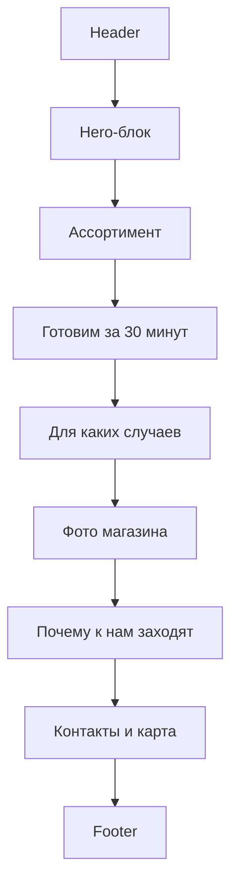

# Техническое задание на разработку landing page магазина «Боярский Край»

**Версия:** 1.0  
**Дата:** 21.06.2026  
**Проект:** landing page мясной лавки и магазина овощей «Боярский Край»  
**Город:** Химки  
**Адрес:** Химки, ул. Калинина, д. 7  
**Телефон:** +7 903 122-00-36  
**Часы работы:** ежедневно, 10:00–21:00  
**Формат сайта:** одностраничный landing page без корзины, форм заявок и личного кабинета.

---

## 1. Краткое описание проекта

Необходимо разработать одностраничный сайт для локального магазина «Боярский Край» в городе Химки.

Магазин продаёт:

- охлаждённое мясо;
- стейки;
- замороженное мясо;
- мясные полуфабрикаты;
- шашлык в маринаде;
- готовую мясную продукцию;
- жареное мясо по предзаказу, ориентировочно за 30 минут;
- овощи;
- напитки/кофе в небольшой кофе-зоне.

Главная задача первой версии сайта — быстро объяснить посетителю, что это за магазин, какой у него ассортимент, где он находится и как с ним связаться.

На первом этапе не требуется сбор заявок, онлайн-заказ, корзина, оплата, личный кабинет или админ-панель.

---

## 2. Цель сайта

Сайт должен выполнять роль понятной локальной витрины магазина.

Основные цели:

1. Представить магазин «Боярский Край».
2. Показать основные категории ассортимента.
3. Сделать акцент на возможности заказать готовое горячее мясо примерно за 30 минут.
4. Дать пользователю быстрый доступ к телефону, адресу, часам работы и маршруту.
5. Сформировать доверие за счёт реальных фотографий магазина, входа, витрины, мясной продукции, овощей и кофе-зоны.
6. Подготовить основу для будущего развития: каталог, цены, предзаказ, мессенджеры, акции, формы и интеграции.

---

## 3. Не входит в первую версию

В рамках MVP не нужно реализовывать:

- корзину;
- онлайн-оплату;
- личный кабинет;
- регистрацию;
- форму обратной связи;
- форму предзаказа;
- CRM-интеграции;
- админ-панель;
- динамическое наличие товаров;
- доставку;
- промокоды;
- программу лояльности;
- личные рекомендации;
- отзывы на сайте;
- блог;
- сложный каталог с фильтрами.

Все эти функции можно заложить как возможные будущие этапы.

---

## 4. Целевая аудитория

Основная аудитория:

- жители Химок рядом с ул. Калинина, д. 7;
- люди, которые ищут мясной магазин рядом с домом;
- покупатели, которым нужны стейки, шашлык или мясо на ужин;
- клиенты, которым удобно купить мясо, овощи и кофе в одном месте;
- люди, которым нужно быстро забрать готовое горячее мясо домой;
- покупатели, которые планируют шашлык, семейный ужин или встречу гостей.

Типовой пользовательский сценарий:

> Пользователь ищет мясо, стейки или шашлык в Химках, открывает сайт, видит ассортимент, понимает адрес и часы работы, звонит в магазин или строит маршрут.

---

## 5. Позиционирование

### 5.1. Основная формулировка

**Боярский Край — мясная лавка, стейки, овощи и горячее мясо по предзаказу в Химках.**

### 5.2. Дополнительная формулировка

Охлаждённое и замороженное мясо, стейки, шашлык в маринаде, мясные полуфабрикаты, овощи и небольшая кофе-зона. Готовим мясо по предзаказу примерно за 30 минут.

### 5.3. Ключевой акцент

Главное отличие, которое нужно показать на сайте:

> В магазине можно не только купить мясо домой, но и заранее заказать горячее мясо к своему приходу.

---

## 6. Общая структура страницы



---

## 7. Header

### 7.1. Состав блока

В шапке сайта должны быть:

- логотип магазина;
- название «Боярский Край»;
- короткое меню-якоря:
  - Ассортимент;
  - Готовим за 30 минут;
  - Фото;
  - Контакты;
- телефон;
- кнопка «Позвонить».

### 7.2. Поведение

- Телефон должен быть кликабельным: `tel:+79031220036`.
- Кнопка «Позвонить» должна вести на звонок по номеру `+79031220036`.
- На мобильной версии меню можно скрыть или заменить компактной кнопкой.
- Header может быть sticky, но не должен занимать слишком много пространства на мобильном экране.
- При клике на пункты меню пользователь должен плавно переходить к соответствующим блокам страницы.

---

## 8. Hero-блок / первый экран

### 8.1. Задача блока

Первый экран должен за 5–10 секунд объяснять:

- что это за магазин;
- что здесь продают;
- где он находится;
- когда работает;
- как позвонить или построить маршрут.

### 8.2. Заголовок

```text
Мясная лавка, стейки и овощи в Химках
```

### 8.3. Подзаголовок

```text
Охлаждённое и замороженное мясо, стейки, шашлык в маринаде, полуфабрикаты, овощи и кофе-зона. Готовим мясо по предзаказу примерно за 30 минут.
```

### 8.4. Информационный блок

```text
Химки, ул. Калинина, д. 7
Ежедневно: 10:00–21:00
+7 903 122-00-36
```

### 8.5. Кнопки

Основные CTA:

- **Позвонить**
- **Построить маршрут**

### 8.6. Визуал

На первом экране нужно использовать один из вариантов:

- фото входа в магазин;
- фото витрины;
- логотип в декоративной рамке;
- комбинацию фото магазина и логотипа.

Рекомендуется использовать реальное фото входа или витрины, потому что это помогает локальному посетителю быстрее узнать магазин.

---

## 9. Блок «Что у нас есть»

### 9.1. Задача блока

Показать ассортимент магазина без полноценного каталога и без цен.

### 9.2. Формат

Сетка из 6 карточек.

Каждая карточка должна содержать:

- изображение или иконку;
- короткий заголовок;
- описание в 1–2 строки.

### 9.3. Карточки ассортимента

#### 1. Охлаждённое мясо

Свежие позиции для жарки, запекания и домашнего ужина.

#### 2. Стейки

Мясо для сковороды, гриля и мангала. Подскажем, какой кусок выбрать.

#### 3. Замороженное мясо

Удобный запас домой для быстрых и сытных блюд.

#### 4. Шашлык в маринаде

Готовое мясо для мангала, дачи и семейных встреч.

#### 5. Мясные полуфабрикаты

Заготовки, которые удобно быстро приготовить дома.

#### 6. Овощи и кофе-зона

Овощи к мясу, продукты к столу и кофе на месте.

---

## 10. Акцентный блок «Готовим по предзаказу за 30 минут»

### 10.1. Задача блока

Отдельно выделить услугу приготовления мяса к приходу клиента.

Это один из ключевых блоков сайта, потому что он отличает магазин от обычной мясной лавки.

### 10.2. Заголовок

```text
Горячее мясо к вашему приходу
```

### 10.3. Текст

```text
Позвоните заранее — мы приготовим мясо ориентировочно за 30 минут. Удобно, если нужно быстро забрать горячее блюдо домой, к ужину или к приходу гостей.
```

### 10.4. CTA

Кнопка:

```text
Позвонить и заказать
```

Кнопка должна вести на `tel:+79031220036`.

### 10.5. Дополнительные элементы

В блок можно добавить:

- иконку огня/гриля;
- фото готового мяса;
- короткую схему: «Позвонили → выбрали → приготовили → забрали горячим».

---

## 11. Блок «Для каких случаев»

### 11.1. Задача блока

Помочь посетителю представить, зачем ему зайти в магазин.

### 11.2. Карточки

#### На ужин домой

Стейки, мясо для жарки, овощи и готовая продукция.

#### На шашлык

Мясо в маринаде и полуфабрикаты для мангала.

#### К приходу гостей

Можно заказать горячее мясо заранее и забрать к нужному времени.

#### Быстро перекусить

Кофе-зона и готовая продукция на месте.

---

## 12. Фото-блок

### 12.1. Задача блока

Повысить доверие к магазину через реальные фотографии.

### 12.2. Требуемые фотографии

Желательно подготовить 8–12 фотографий:

- вход в магазин с улицы;
- вывеска;
- общий вид внутри;
- мясная витрина;
- стейки;
- мясо в маринаде;
- шашлык;
- готовое жареное мясо;
- овощи;
- кофе-зона;
- кассовая зона;
- детали брендинга/логотипа.

### 12.3. Формат блока

- сетка 6–9 фото;
- на мобильной версии — 1 или 2 колонки;
- изображения должны быть оптимизированы;
- для фото ниже первого экрана использовать lazy loading.

### 12.4. Требования к изображениям

- Форматы: WebP/AVIF + fallback JPG/PNG при необходимости.
- Не загружать оригиналы по 5–10 МБ.
- Рекомендуемый размер больших фото: 1600–2000 px по широкой стороне.
- Рекомендуемый размер карточек/превью: 600–900 px по широкой стороне.
- Все изображения должны иметь осмысленный `alt`.

Примеры `alt`:

```text
Вход в магазин Боярский Край в Химках
Витрина с охлаждённым мясом в магазине Боярский Край
Стейки и мясная продукция в магазине Боярский Край
Овощи и кофе-зона в магазине Боярский Край
```

---

## 13. Блок «Почему к нам заходят»

### 13.1. Задача блока

Коротко объяснить преимущества магазина.

### 13.2. Преимущества

Использовать 4–6 преимуществ:

- мясо на каждый день и для особого случая;
- стейки, шашлык и полуфабрикаты;
- горячее мясо по предзаказу;
- овощи и кофе в одном месте;
- удобно для жителей района;
- поможем выбрать мясо под способ приготовления.

### 13.3. Тональность

Текст должен быть простым и человеческим.

Не использовать неподтверждённые формулировки:

- «лучшее мясо в Химках»;
- «самые низкие цены»;
- «номер один»;
- «только фермерское мясо» — если это не подтверждено поставщиками.

---

## 14. Контакты и карта

### 14.1. Состав блока

В нижней части страницы должны быть:

- название магазина;
- адрес;
- телефон;
- часы работы;
- кнопка «Позвонить»;
- кнопка «Построить маршрут»;
- карта или статичный блок с переходом в Яндекс.Карты/Google Maps.

### 14.2. Текст блока

```text
Боярский Край
Химки, ул. Калинина, д. 7
Ежедневно: 10:00–21:00
+7 903 122-00-36
```

### 14.3. Карта

Рекомендуется использовать один из вариантов:

#### Вариант A — кнопка на карту

Более быстрый и простой вариант.

Кнопка «Построить маршрут» ведёт на карту с адресом:

```text
Химки, Калинина, 7
```

#### Вариант B — встроенная карта

Можно встроить карту внизу страницы, но загружать её лениво, чтобы не замедлять первый экран.

### 14.4. Рекомендация

Для MVP предпочтительнее вариант A: кнопка на карту. Встроенную карту можно добавить позже.

---

## 15. Footer

В футере указать:

- название магазина;
- телефон;
- адрес;
- часы работы;
- копирайт текущего года;
- ссылку на политику обработки персональных данных — если позже появятся формы или сбор данных.

Пример:

```text
© 2026 Боярский Край
Химки, ул. Калинина, д. 7
+7 903 122-00-36
Ежедневно: 10:00–21:00
```

---

## 16. Дизайн

### 16.1. Общий стиль

Стиль сайта: современная мясная лавка с боярским/купеческим характером.

Важно не делать сайт слишком «древнерусским». Логотип уже задаёт яркий образ, поэтому интерфейс должен оставаться современным, чистым и удобным.

### 16.2. Ассоциации бренда

Сайт должен передавать ощущения:

- сытно;
- тепло;
- основательно;
- локально;
- по-домашнему;
- мясная лавка у дома;
- можно зайти за продуктами и забрать горячее мясо.

### 16.3. Цветовая палитра

Основные цвета:

| Назначение | Цвет | Комментарий |
|---|---|---|
| Основной брендовый | глубокий красный / бордовый | взять из логотипа |
| Фон | молочный / тёплый белый | вместо холодного белого |
| Основной текст | тёмно-коричневый / почти чёрный | высокая читаемость |
| Дополнительный фон | кремовый / светло-бежевый | для карточек и секций |
| Акцент | древесный / угольный | для декоративных деталей |

### 16.4. Шрифты

Рекомендация:

- заголовки — выразительный, но читаемый serif/slab-serif или плотный display-шрифт;
- основной текст — простой sans-serif.

Не использовать декоративный «старорусский» шрифт для длинного текста, потому что он ухудшит читаемость.

### 16.5. Кнопки

Основные кнопки:

- красный фон;
- белый текст;
- скругление 12–16 px;
- крупный размер;
- хорошо нажимаются на мобильном телефоне.

Вторичные кнопки:

- светлый фон;
- красная рамка;
- красный текст.

### 16.6. Карточки

Карточки ассортимента и сценариев использования:

- скругление 16–24 px;
- лёгкая тень или тонкая рамка;
- фото/иконка сверху;
- заголовок;
- короткое описание;
- без перегруза текстом.

---

## 17. Адаптивность

Сайт должен корректно работать на:

- мобильных телефонах от 360 px;
- планшетах;
- десктопах;
- больших экранах.

### 17.1. Приоритет

Разработка должна быть mobile-first.

Причина: локальный пользователь с высокой вероятностью будет открывать сайт с телефона из поиска или карт.

### 17.2. Мобильная версия

На мобильной версии:

- телефон и маршрут должны быть доступны сразу;
- кнопки должны быть крупными;
- первый экран не должен быть перегружен;
- фото должны быстро загружаться;
- сетки должны превращаться в одну колонку;
- карта не должна ломать страницу;
- sticky header не должен занимать слишком много места.

---

## 18. SEO и локальная оптимизация

### 18.1. Title

```text
Боярский Край — мясная лавка, стейки и овощи в Химках
```

### 18.2. Meta description

```text
Магазин «Боярский Край» в Химках: охлаждённое и замороженное мясо, стейки, шашлык в маринаде, полуфабрикаты, готовое мясо по предзаказу, овощи и кофе-зона. Адрес: ул. Калинина, д. 7.
```

### 18.3. H1

На странице должен быть один H1:

```text
Мясная лавка, стейки и овощи в Химках
```

### 18.4. H2

Рекомендуемые H2:

- Что у нас есть;
- Горячее мясо к вашему приходу;
- Для ужина, шашлыка и гостей;
- Фото магазина;
- Почему к нам заходят;
- Как нас найти.

### 18.5. Локальные ключевые фразы

Использовать естественно, без переспама:

- мясной магазин в Химках;
- мясная лавка Химки;
- стейки в Химках;
- шашлык в маринаде Химки;
- мясо на заказ Химки;
- готовое мясо Химки;
- овощи Химки Калинина 7;
- магазин мяса Калинина 7.

### 18.6. Open Graph

Добавить Open Graph-разметку для корректного отображения при отправке ссылки в мессенджерах:

```html
<meta property="og:title" content="Боярский Край — мясная лавка, стейки и овощи в Химках">
<meta property="og:description" content="Охлаждённое и замороженное мясо, стейки, шашлык в маринаде, полуфабрикаты, готовое мясо по предзаказу, овощи и кофе-зона.">
<meta property="og:image" content="https://example.com/images/og-image.jpg">
<meta property="og:type" content="website">
<meta property="og:url" content="https://example.com">
```

### 18.7. Structured Data / JSON-LD

Добавить JSON-LD разметку `Store` или `LocalBusiness`.

Пример:

```html
<script type="application/ld+json">
{
  "@context": "https://schema.org",
  "@type": "Store",
  "name": "Боярский Край",
  "image": "https://example.com/images/logo.png",
  "telephone": "+79031220036",
  "address": {
    "@type": "PostalAddress",
    "streetAddress": "ул. Калинина, д. 7",
    "addressLocality": "Химки",
    "addressCountry": "RU"
  },
  "openingHours": "Mo-Su 10:00-21:00",
  "url": "https://example.com"
}
</script>
```

Перед публикацией заменить `example.com` на реальный домен.

---

## 19. Локальные карточки бизнеса

После запуска сайта рекомендуется добавить ссылку на него в карточки бизнеса:

- Яндекс Бизнес / Яндекс Карты;
- Google Business Profile / Google Maps;
- 2ГИС — при необходимости.

В карточках должны совпадать:

- название;
- адрес;
- телефон;
- часы работы;
- фотографии;
- ссылка на сайт.

Также желательно добавить:

- логотип;
- фото входа;
- фото витрины;
- фото товаров;
- описание ассортимента;
- актуальные категории бизнеса.

---

## 20. Аналитика

### 20.1. Системы аналитики

Подключить:

- Яндекс.Метрику;
- Google Analytics — опционально.

### 20.2. События

Настроить события:

| Событие | Описание |
|---|---|
| `click_phone_header` | клик по телефону/кнопке звонка в шапке |
| `click_phone_hero` | клик по телефону на первом экране |
| `click_phone_preorder` | клик «Позвонить и заказать» |
| `click_route_hero` | клик «Построить маршрут» на первом экране |
| `click_route_contacts` | клик «Построить маршрут» в контактах |
| `scroll_contacts` | пользователь дошёл до блока контактов |

### 20.3. Цели аналитики

Главные цели:

- понять, сколько людей кликают на звонок;
- понять, сколько людей строят маршрут;
- оценить, какие блоки пользователи просматривают;
- подготовить базу для будущей рекламы и SEO.

---

## 21. Производительность

### 21.1. Общие требования

- Минимизировать CSS и JS.
- Не подключать тяжёлые библиотеки без необходимости.
- Оптимизировать изображения.
- Использовать lazy loading для фото ниже первого экрана.
- Не загружать карту сразу, если можно заменить её кнопкой или ленивой загрузкой.
- Использовать кэширование статических файлов.

### 21.2. Целевые показатели

Ориентиры:

| Метрика | Цель |
|---|---:|
| Lighthouse Performance | 85+ |
| Lighthouse SEO | 90+ |
| Lighthouse Accessibility | 90+ |
| Lighthouse Best Practices | 90+ |
| LCP | до 2,5 сек |
| INP | до 200 мс |
| CLS | до 0,1 |

---

## 22. Доступность

Минимальные требования:

- все кнопки и ссылки доступны с клавиатуры;
- видимый focus state у интерактивных элементов;
- достаточный контраст текста и фона;
- у изображений есть `alt`;
- текст не должен быть встроен в картинки, кроме логотипа;
- интерактивные элементы должны быть достаточно крупными для нажатия на мобильных устройствах;
- не использовать слишком мелкий шрифт.

Ориентир по контрасту:

- обычный текст — минимум 4.5:1;
- крупный текст — минимум 3:1.

---

## 23. Техническая реализация

### 23.1. Рекомендуемый вариант для MVP

Для первой версии достаточно статического сайта.

Варианты реализации:

- HTML + CSS + JavaScript;
- React + Vite;
- Next.js в режиме статической генерации.

### 23.2. Рекомендация

Если сайт будет только визиткой, можно использовать простой статический HTML/CSS/JS.

Если планируется дальнейшее развитие в каталог, акции, предзаказ и админку, лучше сразу использовать React/Next.js.

### 23.3. Требования к коду

- семантическая HTML-разметка;
- один `h1`;
- логичная структура `h2`/`h3`;
- адаптивная сетка;
- CSS-переменные для цветов;
- изображения с `width`/`height`, чтобы не было layout shift;
- lazy loading для изображений ниже первого экрана;
- aria-label для иконок и кнопок без текстового описания;
- корректные ссылки `tel:` и карты.

---

## 24. Рекомендуемая структура проекта

Пример для статической реализации:

```text
boyarskiy-kray-landing/
  index.html
  assets/
    images/
      logo.png
      hero-storefront.webp
      meat-display.webp
      steaks.webp
      shashlik.webp
      ready-meat.webp
      vegetables.webp
      coffee-zone.webp
      og-image.jpg
    icons/
      phone.svg
      map.svg
      grill.svg
  css/
    styles.css
  js/
    main.js
  README.md
```

Пример для React/Vite:

```text
boyarskiy-kray-landing/
  public/
    images/
      logo.png
      og-image.jpg
  src/
    components/
      Header.jsx
      Hero.jsx
      Assortment.jsx
      Preorder.jsx
      UseCases.jsx
      Gallery.jsx
      Benefits.jsx
      Contacts.jsx
      Footer.jsx
    data/
      content.js
    styles/
      variables.css
      global.css
    App.jsx
    main.jsx
  package.json
  README.md
```

---

## 25. Контент для сайта

### 25.1. Hero

```text
Боярский Край
Мясная лавка, стейки и овощи в Химках

Охлаждённое и замороженное мясо, стейки, шашлык в маринаде, полуфабрикаты, овощи и кофе-зона. Готовим мясо по предзаказу примерно за 30 минут.

Химки, ул. Калинина, д. 7
Ежедневно: 10:00–21:00
+7 903 122-00-36
```

Кнопки:

```text
Позвонить
Построить маршрут
```

### 25.2. Ассортимент

```text
Что у нас есть

Охлаждённое мясо
Свежие позиции для жарки, запекания и домашнего ужина.

Стейки
Мясо для сковороды, гриля и мангала. Подскажем, какой кусок выбрать.

Замороженное мясо
Удобный запас домой для быстрых и сытных блюд.

Шашлык в маринаде
Готовое мясо для мангала, дачи и семейных встреч.

Мясные полуфабрикаты
Заготовки, которые удобно быстро приготовить дома.

Овощи и кофе-зона
Овощи к мясу, продукты к столу и кофе на месте.
```

### 25.3. Предзаказ

```text
Горячее мясо к вашему приходу

Позвоните заранее — мы приготовим мясо ориентировочно за 30 минут. Удобно, если нужно быстро забрать горячее блюдо домой, к ужину или к приходу гостей.

Позвонить и заказать
```

### 25.4. Для каких случаев

```text
Для ужина, шашлыка и гостей

На ужин домой
Стейки, мясо для жарки, овощи и готовая продукция.

На шашлык
Мясо в маринаде и полуфабрикаты для мангала.

К приходу гостей
Можно заказать горячее мясо заранее и забрать к нужному времени.

Быстро перекусить
Кофе-зона и готовая продукция на месте.
```

### 25.5. Контакты

```text
Как нас найти

Боярский Край
Химки, ул. Калинина, д. 7
Ежедневно: 10:00–21:00
+7 903 122-00-36

Позвонить
Построить маршрут
```

---

## 26. Приёмочные критерии

Сайт считается готовым, если выполнены следующие условия:

1. На первом экране видны название, позиционирование, адрес, телефон, часы работы и CTA.
2. Кнопка телефона открывает звонок на `+79031220036`.
3. Кнопка маршрута открывает карту с адресом магазина.
4. Есть блок с ассортиментом минимум из 6 категорий.
5. Есть отдельный блок про готовое мясо по предзаказу за 30 минут.
6. Есть блок «Для каких случаев».
7. Есть фото-блок с реальными фотографиями магазина/продукции.
8. Есть блок контактов внизу страницы.
9. Сайт корректно работает на мобильном телефоне.
10. Все изображения оптимизированы.
11. Добавлены `title`, `description`, `h1`.
12. Добавлена JSON-LD разметка `Store` или `LocalBusiness`.
13. Подключена аналитика.
14. Настроены события кликов по телефону и маршруту.
15. На странице нет неработающих кнопок.
16. На странице нет пустых разделов.
17. Контактная информация на сайте совпадает с карточками в Яндекс/Google/2ГИС.
18. Lighthouse показывает ориентировочно:
    - Performance: 85+;
    - SEO: 90+;
    - Accessibility: 90+;
    - Best Practices: 90+.

---

## 27. План работ

### Этап 1. Подготовка материалов

- получить финальный логотип в PNG/SVG;
- подготовить фото входа;
- подготовить фото витрины;
- подготовить фото мясной продукции;
- подготовить фото овощей;
- подготовить фото кофе-зоны;
- подтвердить список ассортимента;
- подтвердить ссылку на карту;
- подтвердить, будут ли WhatsApp/Telegram.

### Этап 2. Дизайн

- подготовить desktop-макет;
- подготовить mobile-макет;
- согласовать цветовую палитру;
- согласовать стили кнопок и карточек;
- согласовать тексты;
- подготовить OG-изображение для соцсетей и мессенджеров.

### Этап 3. Разработка

- сверстать страницу;
- подключить адаптивность;
- подключить кнопки звонка и маршрута;
- добавить SEO-теги;
- добавить JSON-LD;
- добавить аналитику;
- оптимизировать изображения.

### Этап 4. Тестирование

- проверить мобильную версию;
- проверить desktop-версию;
- проверить кнопки звонка;
- проверить кнопки маршрута;
- проверить отображение фото;
- проверить скорость загрузки;
- проверить title/description;
- проверить микроразметку;
- проверить доступность;
- проверить отсутствие битых ссылок.

### Этап 5. Публикация

- подключить домен;
- настроить HTTPS;
- добавить сайт в Яндекс.Вебмастер;
- добавить сайт в Google Search Console;
- добавить ссылку на сайт в Яндекс Бизнес;
- добавить ссылку на сайт в Google Business Profile;
- проверить корректность отображения сайта после публикации.

---

## 28. Возможное развитие после MVP

После запуска первой версии можно добавить:

- каталог категорий с фото;
- цены на ключевые позиции;
- раздел «Сегодня в наличии»;
- предзаказ через WhatsApp/Telegram;
- форму «Заказать к времени»;
- акции недели;
- отзывы;
- страницу «Шашлык и мясо к празднику»;
- SEO-страницы под запросы:
  - «стейки Химки»;
  - «шашлык Химки»;
  - «мясной магазин Химки»;
  - «готовое мясо Химки»;
- интеграцию с CRM;
- админку для редактирования ассортимента;
- рекламные посадочные страницы.

---

## 29. Справочные источники для разработчика

При реализации SEO, локальной оптимизации, доступности и производительности учитывать следующие источники:

- Google Search Central — Local Business structured data: https://developers.google.com/search/docs/appearance/structured-data/local-business
- Schema.org — LocalBusiness: https://schema.org/LocalBusiness
- Google Business Profile: https://business.google.com/en-all/business-profile/
- Google Business Profile Help — photos and videos: https://support.google.com/business/answer/6103862
- Yandex Business — fill out company information: https://yandex.com/support/business-priority/en/manage/edit
- Yandex Business — logo, photos and videos: https://yandex.com/support/business-priority/en/manage/photos
- Google Search Central — Core Web Vitals: https://developers.google.com/search/docs/appearance/core-web-vitals
- W3C WCAG 2.2: https://www.w3.org/TR/WCAG22/

---

## 30. Краткое резюме

Для первой версии нужен простой, быстрый и понятный сайт-витрина.

Главный фокус:

- мясная лавка в Химках;
- стейки, мясо, шашлык, полуфабрикаты, овощи и кофе;
- горячее мясо по предзаказу примерно за 30 минут;
- адрес, телефон и маршрут всегда под рукой.

Лучшее решение для MVP — одна адаптивная страница с реальными фото, понятной структурой и простыми CTA: «Позвонить» и «Построить маршрут».
